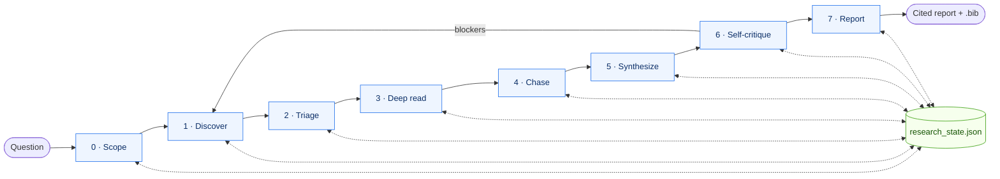

# scholar-deep-research — From Question to Cited Report

[中文文档](README_CN.md) &middot; 🌐 **Website:** [agents365-ai.github.io/scholar-deep-research](https://agents365-ai.github.io/scholar-deep-research/)

An 8-phase (Phase 0..7), script-driven academic research workflow that turns a research question into a structured, cited report. Multi-source federation across 6 databases, mandatory self-critique, parallel deep-read agent fan-out.

## Why this exists

Every script under `scripts/` is pure data — search, dedupe, rank, citation-chase, bibliography export. **Zero LLM calls inside the pipeline.** The host LLM is the orchestrator: it reads `SKILL.md`, calls the CLI tools, decides what to do next based on JSON envelopes coming back. That separation buys three properties that LLM-in-the-loop pipelines can't have:

- **Reproducible** — same state → same output, no model nondeterminism.
- **Auditable** — every mutation flows through one `research_state.py` boundary.
- **Testable** — the 148-test smoke suite at `scripts/tests/run.py` runs in ~4 s with no API keys, no network, no model.

MCP tools and the host LLM enrich the agent's decisions; they never sit on the critical path.

## What a run looks like

Just describe what you want:

```
Run a deep research report on CRISPR base editing for Duchenne muscular dystrophy.
```

The skill walks the 8 phases automatically:

```
[Phase 0] Restating: "What is the current state of CRISPR base editing as a
          therapeutic for Duchenne muscular dystrophy?"
          Archetype: literature_review
          → research_state.json initialized

[Phase 1] OpenAlex + PubMed + arXiv + Crossref across 3 clusters...
          Round 1: 187 hits, 142 unique. Round 2: 94 hits, 31 new.
          Saturation: paper=11%, author=18%, venue=14% → SATURATED

[Phase 2] Ranking with literature-review weights...
          Top 20 selected. Score components written to state.
          Triage: 10 deep + 10 skim (--deep-ratio 0.5).
          Prefetch: 8/10 deep-tier PDFs cached, 2 paywalled (no OA).

[Phase 3] Deep tier: 8 parallel agents dispatched (1 wave) — each reads
          a local pdf_path, no per-agent download.
          8 returned full evidence; 2 paywalled papers carry
          evidence_unavailable from prefetch. Skim tier: 10
          abstract-derived evidence stubs auto-filled.

[Phase 4] Citation chasing on top 8 seeds, depth 1.
          Added 24 candidates, 6 re-scored into top 20.

[Phase 5] Themes: delivery, editing efficiency, off-target safety,
          pre-clinical, clinical translation.
          Tensions: AAV serotype optimality (3 papers disagree).

[Phase 6] Self-critique flagged 2 single-source claims and a recency gap.
          Ran focused search; added 4 papers.

[Phase 7] reports/crispr-base-editing-dmd_20260411.md (84 refs)
```

Output: `reports/<slug>_<YYYYMMDD>.md` plus a matching `.bib`.

## What you get

- **Phase 0..7 cited-report pipeline** with 7 enforced phase-transition gates (G1..G7 in `scripts/_gates.py`)
- **7 federated sources** — OpenAlex, arXiv, Crossref, PubMed, DBLP, bioRxiv (all free, no key); Exa (open-web, opt-in via `EXA_API_KEY`)
- **Cross-source deduplication** — DOI-first, title-similarity fallback; one paper, one record
- **Three-axis saturation** — paper / author / venue novelty all must drop below threshold for Phase 1 to terminate. Catches the failure mode where queries keep surfacing different papers from the same lab while exploration has stalled
- **Parallel deep-read fan-out (Phase 3)** — selected papers split into `deep` / `skim` / `defer` tiers. Deep tier dispatched in waves of 8–10 isolated-context agents, each reading one PDF; optional PDF prefetch ahead of dispatch surfaces paywalled papers as `evidence_unavailable` *before* a wave starts
- **Transparent ranking** — published formula `α·relevance + β·citations + γ·recency + δ·venue_prior`, components written into state, every paper inspectable
- **Mandatory Phase 6 self-critique** — 14-point adversarial checklist; findings ship in the report appendix
- **Citation rigor** — every claim in the body carries a `[^id]` anchor; unanchored prose fails the gate
- **5 archetype templates** — `literature_review` / `systematic_review` / `scoping_review` / `comparative_analysis` / `grant_background`, picked from user intent
- **BibTeX / CSL-JSON / RIS export** — bibliography generated from state, never retyped

## How it works

```
Phase 0  Scope        question decomposition + archetype + state init
Phase 1  Discovery    multi-source search → dedupe → 3-axis saturation check
Phase 2  Triage       ranking → top-N selection → tier triage → optional PDF prefetch
Phase 3  Deep read    parallel agent fan-out (deep tier) + abstract stub (skim tier)
Phase 4  Chasing      citation graph (forward + backward)
Phase 5  Synthesis    thematic clustering → tension map
Phase 6  Self-critique  14-point adversarial checklist (mandatory)
Phase 7  Report       render archetype template → export bibliography
```



Each phase transition runs through `python scripts/research_state.py advance`, which executes the gate predicate and refuses with a structured `gate_not_met` envelope (listing failing checks **and** suggested next commands) when criteria aren't met. There is no way to skip a gate by setting `phase` directly. Phase 6 (self-critique) can loop back to Phase 1 when it finds gaps; everything else is linear.

Every mutating command (`ingest`, `rank`, `dedupe`, `citation-chase`) accepts `--idempotency-key` — a retried call with the same key returns the original result without re-mutating state, so agent crash-recovery is contract-idempotent. The state file itself is written under a sibling `.lock` file with atomic `os.replace`, so concurrent Phase 1 searches are race-free.

## Comparison: with vs without this skill

| Capability | Native agent | This skill |
|------------|--------------|------------|
| Multi-source federated search | One source per turn | 6 sources, federated |
| Multi-round search with saturation gate | One-shot | Three-axis saturation check |
| Cross-source deduplication | None | DOI-first, title-similarity fallback |
| Transparent ranking formula | Opaque | Formula + per-paper component scores in state |
| Forward/backward citation chase | None | OpenAlex graph expansion |
| Resumable state | Stateless per turn | `research_state.json` |
| Choice of report archetype | Generic outline | 5 archetypes selected from intent |
| Self-critique pass | None | Mandatory 14-point checklist (Phase 6) |
| Citation anchors enforced | Claims float | Every claim needs `[^id]`; gate rejects unanchored |
| BibTeX / CSL-JSON / RIS export | None | Generated from state |
| PDF text extraction | Sometimes | `pypdf` with scanned-PDF detection + OA-chain DOI resolution |
| Parallel deep-read fan-out | Sequential | Wave-based agent dispatch + tier-aware triage |
| MCP graceful degradation | N/A | Scripts work even when MCP times out |

## Quick start

### Prerequisites

- **Python ≥ 3.9**
- **Install dependencies:**
  ```bash
  pip install -r requirements.txt
  ```
  Pulls in `httpx` (HTTP client) and `pypdf` (PDF text extraction).

No API keys required. For higher OpenAlex / Crossref / PubMed rate limits, pass `--email <you@host>` (polite pool) or `--api-key` (NCBI). All scripts work without these.

### Install

```bash
# Any agent (Claude Code, Cursor, Copilot, etc.)
npx skills add Agents365-ai/365-skills -g

# Claude Code only
> /plugin marketplace add Agents365-ai/365-skills
> /plugin install scholar-deep-research
```

Then `pip install -r requirements.txt` inside the install dir to pull in `httpx` + `pypdf`.

Also published on [SkillsMP](https://skillsmp.com/) and [ClawHub](https://clawhub.ai/) — each handles updates through its own marketplace.

<details>
<summary>Manual install (direct git clone)</summary>

```bash
# Clone the source repo, then symlink the inner skill dir into your platform's skills directory.
git clone https://github.com/Agents365-ai/scholar-deep-research.git
ln -s "$PWD/scholar-deep-research/skills/scholar-deep-research" ~/.claude/skills/scholar-deep-research
pip install -r ~/.claude/skills/scholar-deep-research/requirements.txt
```

Replace `~/.claude/skills/` with the appropriate path for your host: `~/.config/opencode/skills/`, `~/.openclaw/skills/`, `~/.hermes/skills/research/`, `~/.pimo/skills/`, or `~/.agents/skills/`.

</details>

## Multi-platform support

Works with Claude Code, Codex, OpenCode, OpenClaw / ClawHub, Hermes Agent, pi-mono, and SkillsMP — any agent that supports the [Agent Skills](https://agentskills.io) format.

## Known Limitations

- **No Google Scholar / Web of Science / Scopus** — these have no public API or require institutional access. Mention in report appendix as "not consulted" if it matters.
- **Scanned PDFs** — `extract_pdf.py` detects them but doesn't OCR. Use a separate OCR step if needed.
- **DOI resolution requires open access** — `--doi` mode only finds legally open-access PDFs (via [paper-fetch](https://github.com/Agents365-ai/paper-fetch) or Unpaywall). Paywalled papers fall back to abstract-only.
- **arXiv has no citation counts** — arXiv-only papers get `citations=null` and a 0 contribution from the citation component of the rank score.
- **PubMed full abstracts** — fetched on demand only (`--with-abstracts`); the default round-trip uses esummary for speed.
- **English-language bias** — all sources index non-English work but search quality varies. Note in the report's limitations if the topic has substantial non-English literature.
- **Ranking is bag-of-words for relevance** — for semantic re-ranking, plug an embedding model and write the result back into `state.papers[*].score_components.relevance`. The pipeline is designed for that override.

## License

MIT

## Support

If this skill helps you, consider supporting the author:

<table>
  <tr>
    <td align="center">
      
      <br>
      <b>WeChat Pay</b>
    </td>
    <td align="center">
      
      <br>
      <b>Alipay</b>
    </td>
    <td align="center">
      
      <br>
      <b>Buy Me a Coffee</b>
    </td>
    <td align="center">
      
      <br>
      <b>Give a Reward</b>
    </td>
  </tr>
</table>

## Author

**Agents365-ai**

- Bilibili: https://space.bilibili.com/441831884
- GitHub: https://github.com/Agents365-ai
