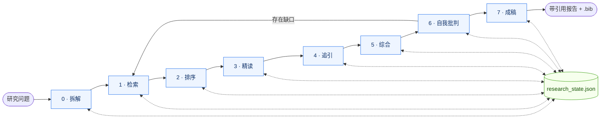

# scholar-deep-research — 从问题到带引用的研究报告

[English](README.md) &middot; 🌐 **官网:** [agents365-ai.github.io/scholar-deep-research/zh.html](https://agents365-ai.github.io/scholar-deep-research/zh.html)

8 阶段（Phase 0..7）、脚本驱动的学术研究工作流，将研究问题转化为结构化、带引用的研究报告。跨 7 个数据库联邦检索，强制自我批判，Phase 3 并行精读派发，Phase 4 双 backend（OpenAlex + Semantic Scholar）引用追溯。

## 为什么有这个项目

`scripts/` 下的每个脚本都是纯数据处理——检索、去重、排序、追引、参考文献导出。**流水线内部不含任何 LLM 调用**。宿主 LLM 是编排者：它读 `SKILL.md`、调用 CLI 工具、根据返回的 JSON 信封决定下一步。这种分工换来三个 LLM-in-the-loop 流水线无法兼得的属性：

- **可复现** — 相同状态 → 相同输出，无模型不确定性
- **可审计** — 所有状态变更都经过 `research_state.py` 这一道边界
- **可测试** — `scripts/tests/run.py` 的 148 项冒烟测试约 4 秒跑完，无需 API key、无需网络、无需模型

MCP 工具和宿主 LLM 用于丰富 agent 的判断，但永远不在关键路径上。

## 一次运行长什么样

直接描述你想要的：

```
帮我做一份关于 CRISPR 碱基编辑治疗杜氏肌营养不良的深度研究报告。
```

skill 自动走完 8 个阶段：

```
[Phase 0] 重述："CRISPR 碱基编辑作为杜氏肌营养不良治疗手段的当前进展？"
          原型：literature_review
          → research_state.json 已初始化

[Phase 1] OpenAlex + PubMed + arXiv + Crossref 跨 3 个 cluster 检索...
          第 1 轮：187 命中，142 唯一。第 2 轮：94 命中，31 新增。
          饱和度：论文=11%, 作者=18%, 期刊=14% → 已饱和

[Phase 2] 按文献综述权重排序...
          选出 top 20。各项分量已写入 state。
          Triage：10 deep + 10 skim（--deep-ratio 0.5）。
          预取：deep 档 8/10 已缓存，2 篇付费墙(无 OA)。

[Phase 3] Deep 档：派发 8 个并行 agent（1 波）—— 各自读本地 pdf_path,
          不再走网络下载。
          8 个返回完整证据；2 篇付费墙论文已带 evidence_unavailable
          (来自预取阶段)。Skim 档：10 篇自动生成摘要级证据片段。

[Phase 4] 对 top 8 种子做 depth=1 引用追踪。
          新增 24 个候选，6 个进入 top 20。

[Phase 5] 主题：递送、编辑效率、脱靶安全、临床前、临床转化。
          张力：AAV 血清型最优解（3 篇论文意见相左）。

[Phase 6] 自我批判发现 2 条单源论断与 1 个时效缺口。
          运行精准检索；新增 4 篇论文。

[Phase 7] reports/crispr-base-editing-dmd_20260411.md（84 篇引用）
```

输出：`reports/<slug>_<YYYYMMDD>.md`，并附带同名 `.bib`。

## 你能拿到什么

- **Phase 0..7 带引用的报告流水线**，相邻阶段之间有 7 道强制门控（`scripts/_gates.py` 中的 G1..G7）
- **7 个联邦数据源** — OpenAlex、arXiv、Crossref、PubMed、DBLP、bioRxiv（全部免费、无需 API key）；Exa（开放网页检索，可选，需 `EXA_API_KEY`）
- **跨源去重** — DOI 优先、标题相似度兜底；一篇论文一条记录
- **三轴饱和度** — 论文新增 / 作者新增 / 期刊新增三轴必须**同时**低于阈值，Phase 1 才停止。能识破"查询不断检出同一实验室或同一期刊的不同论文，但探索其实已停滞"这种失败模式
- **Phase 3 并行精读派发** — 选中论文按确定性 triage 切成 `deep` / `skim` / `defer` 三档。Deep 档以每波 8–10 个隔离上下文 agent 派发，各自读一篇 PDF；可选 PDF 预取在派发**前**就把付费墙论文标成 `evidence_unavailable`
- **透明排序** — 公开公式 `α·相关性 + β·引用 + γ·时效 + δ·期刊先验`，各项分量写入 state，每篇论文可查
- **强制 Phase 6 自我批判** — 14 项对抗性检查清单，发现写入报告附录
- **引用严谨** — 正文每条非平凡论断必须带 `[^id]` 锚点，无锚点不通过门控
- **5 种报告原型** — `literature_review` / `systematic_review` / `scoping_review` / `comparative_analysis` / `grant_background`，按用户意图自动选择
- **BibTeX / CSL-JSON / RIS 导出** — 参考文献从 state 生成，无需重打

## 工作流程

```
Phase 0  Scope        问题拆解 + 原型选择 + 状态初始化
Phase 1  Discovery    多源检索 → 去重 → 三轴饱和度检查
Phase 2  Triage       排序 → top-N 选择 → 分档 triage → 可选 PDF 预取
Phase 3  Deep read    deep 档并行 agent 派发 + skim 档摘要证据片段
Phase 4  Chasing      引用网络（正向 + 反向）
Phase 5  Synthesis    主题聚类 → 张力图谱
Phase 6  Self-critique  14 项对抗性检查清单（强制）
Phase 7  Report       渲染原型模板 → 导出参考文献
```



每个阶段跃迁都通过 `python scripts/research_state.py advance` 进行，该命令执行门控谓词，不满足时返回结构化的 `gate_not_met` 信封（列出失败的检查项**并**给出建议下一步命令）。无法通过直接设置 `phase` 绕过门控。Phase 6 自我批判如果发现覆盖不足，会回到 Phase 1 补检索；其余阶段是线性的。

每个会变更状态的命令（`ingest`、`rank`、`dedupe`、`citation-chase`）都接受 `--idempotency-key`——带相同 key 的重试调用会返回原结果而不会重复变更状态，因此 agent 的崩溃恢复是契约级幂等。状态文件本身通过同目录下的 `.lock` 文件加独占锁、以 `os.replace` 原子替换写入，因此 Phase 1 的并发检索天然互不竞争。

## 对比：用 vs 不用

| 能力 | 原生智能体 | 本 skill |
|------|-----------|---------|
| 多源联邦检索 | 一次一个源 | 7 个源联邦 |
| 多轮检索 + 饱和度门控 | 一次性 | 三轴饱和度检查 |
| 跨源去重 | 无 | DOI 优先、标题相似度兜底 |
| 透明排序公式 | 黑盒 | 公式 + 每篇论文分量写入 state |
| 正向 / 反向引用追踪 | 无 | OpenAlex 图扩展 |
| 可断点续做 | 每轮无状态 | `research_state.json` |
| 报告原型选择 | 通用大纲 | 5 种原型按意图选择 |
| 自我批判环节 | 无 | 强制 14 项检查（Phase 6） |
| 引用锚点强制 | 论断悬空 | 每条论断必须 `[^id]`，门控拒绝悬空文段 |
| BibTeX / CSL-JSON / RIS 导出 | 无 | 从 state 生成 |
| PDF 文本提取 | 偶尔 | `pypdf` + 扫描版检测 + OA 链 DOI 解析 |
| 并行精读派发 | 逐篇串行 | 波次式 agent 派发 + 分档 triage |
| MCP 优雅降级 | 不适用 | 脚本在 MCP 超时时仍可完成 |

## 快速开始

### 前置条件

- **Python ≥ 3.9**
- **安装依赖：**
  ```bash
  pip install -r requirements.txt
  ```
  仅引入 `httpx`（HTTP 客户端）与 `pypdf`（PDF 文本提取）。

无需 API key。如需更高的 OpenAlex / Crossref / PubMed 限流，可加 `--email <你@主机>`（礼貌池）或 `--api-key`（NCBI），但所有脚本不带这些参数也能正常工作。

### 安装

```bash
# 任意 agent（Claude Code、Cursor、Copilot 等）
npx skills add Agents365-ai/365-skills -g

# 仅 Claude Code
> /plugin marketplace add Agents365-ai/365-skills
> /plugin install scholar-deep-research
```

随后在安装目录下执行 `pip install -r requirements.txt`，安装 `httpx` + `pypdf`。

也已发布到 [SkillsMP](https://skillsmp.com/) 与 [ClawHub](https://clawhub.ai/)，各自的市场负责升级。

<details>
<summary>手动安装（直接 git clone）</summary>

```bash
# 克隆源仓库后，将内层 skill 目录软链到对应宿主平台的 skills 目录
git clone https://github.com/Agents365-ai/scholar-deep-research.git
ln -s "$PWD/scholar-deep-research/skills/scholar-deep-research" ~/.claude/skills/scholar-deep-research
pip install -r ~/.claude/skills/scholar-deep-research/requirements.txt
```

将 `~/.claude/skills/` 替换为你的宿主平台对应路径：`~/.config/opencode/skills/`、`~/.openclaw/skills/`、`~/.hermes/skills/research/`、`~/.pimo/skills/` 或 `~/.agents/skills/`。

</details>

## 多平台支持

支持 Claude Code、Codex、OpenCode、OpenClaw / ClawHub、Hermes Agent、pi-mono、SkillsMP——任何兼容 [Agent Skills](https://agentskills.io) 格式的 agent。

## 已知限制

- **不含 Google Scholar / Web of Science / Scopus** — 这些数据源无公开 API 或需机构访问权限。如有需要可在报告附录注明"未检索"
- **扫描版 PDF** — `extract_pdf.py` 能检测但不做 OCR。如需识别文字请单独走 OCR 流程
- **DOI 解析需开放获取** — `--doi` 模式仅能找到合法开放获取的 PDF（通过 [paper-fetch](https://github.com/Agents365-ai/paper-fetch) 或 Unpaywall）。付费墙论文退化为仅摘要
- **arXiv 无引用计数** — 仅出现在 arXiv 的论文 `citations=null`，排序公式中引用项贡献为 0
- **PubMed 完整摘要** — 默认只取 esummary 以提速；需要全文摘要请加 `--with-abstracts`
- **英文偏倚** — 多个数据源都收录非英文文献，但检索质量参差。若主题非英文文献多，请在报告局限性中注明
- **相关性使用 bag-of-words** — 如需语义重排，可接入 embedding 模型并将结果写回 `state.papers[*].score_components.relevance`，pipeline 已为此设计

## 许可证

MIT

## Discord

加入 Discord 交流（面向海外用户）：[https://discord.gg/pCV3P9hNY](https://discord.gg/pCV3P9hNY)

## 微信交流群

扫描下方二维码加入微信交流群，获取帮助、提问和最新动态：

<p align="center">
  
</p>

## 支持作者

如果这个 skill 对你有帮助，欢迎请作者喝杯咖啡：

<table>
  <tr>
    <td align="center">
      
      <br>
      <b>微信支付</b>
    </td>
    <td align="center">
      
      <br>
      <b>支付宝</b>
    </td>
    <td align="center">
      
      <br>
      <b>Buy Me a Coffee</b>
    </td>
    <td align="center">
      
      <br>
      <b>给个鼓励</b>
    </td>
  </tr>
</table>

## 作者

**Agents365-ai**

- Bilibili: https://space.bilibili.com/441831884
- GitHub: https://github.com/Agents365-ai
