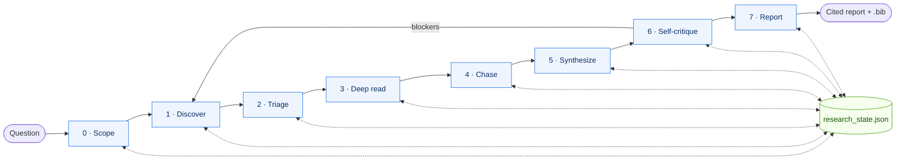

# Architecture — how the skill works

[中文](ARCHITECTURE_CN.md) · [← back to README](../README.md)

## The 8 phases

| # | Phase | What happens |
|---|---|---|
| 0 | Scope | question decomposition + archetype + state init |
| 1 | Discovery | multi-source search → dedupe → 3-axis saturation check |
| 2 | Triage | ranking → top-N selection → tier triage → optional PDF prefetch |
| 3 | Deep read | parallel agent fan-out (deep tier) + abstract stub (skim tier) |
| 4 | Chasing | citation graph (forward + backward) |
| 5 | Synthesis | thematic clustering → tension map |
| 6 | Self-critique | 14-point adversarial checklist (mandatory) |
| 7 | Report | render archetype template → export bibliography |

## State as single source of truth

`research_state.json` is the only artifact that crosses phases. Every script reads and writes it through `scripts/research_state.py` (the apply_* family); no script touches the file directly. Writes are atomic + exclusive-locked so concurrent Phase 1 searches are race-free.

Paper IDs normalize in priority order: `doi:...` → `openalex:W...` → `arxiv:...` → `pmid:...`. The dedupe logic in `dedupe_papers.py` depends on this ordering.

## Gates, not prose

Phase transitions go through `python scripts/research_state.py advance`. The G1..G7 predicates live in `scripts/_gates.py` as pure functions; the agent cannot bypass them by setting `phase` directly (the `set` subcommand whitelists `archetype` and `report_path` only). A gate failure returns a structured `gate_not_met` envelope with the failing check and a `next:` list of suggested commands — the agent recovers without a discovery round-trip.

## Idempotent retries

Every mutating command (`ingest`, `rank`, `dedupe`, `citation-chase`) accepts `--idempotency-key`. Retried calls with the same key replay the cached response; the same key with different semantic arguments returns `idempotency_key_mismatch` rather than silently serving stale data. The cache lives under `${SCHOLAR_CACHE_DIR:-.scholar_cache}/`.

## CLI contract

Every script obeys the [agent-native-design](https://github.com/Agents365-ai/agent-native-design) contract: structured JSON envelope on stdout (`{ok, data, meta}` for success, `{ok: false, error: {code, message, retryable, …}}` for failure), `--schema` introspection at every level, stable exit codes (0/1/2/3/4), dry-run on read-heavy commands, idempotency-key on mutating ones. The current score is 28/28 on the design rubric.

## Scripts are the spine, MCP / WebFetch are the skin

The pipeline runs offline-first on stdlib HTTP. Semantic Scholar (`mcp__asta__*`) and Brave Search MCP tools enrich phases; if they time out, the phase continues. Host-native web tools (Claude Code's WebFetch, OpenCode's webfetch) enter only in **Phase 3 step (d)** as a last-resort PDF replacement: when the OA chain (paper-fetch → Unpaywall → Semantic Scholar → sci-hub) fails to fetch a paper, the agent tries `WebFetch(doi.org/...)` to grab the publisher's landing page HTML and salvage abstract-level evidence rather than dropping the paper to `evidence_unavailable`.
