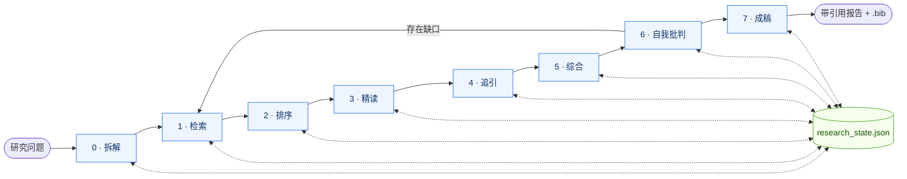

# 架构 — skill 如何工作

[English](ARCHITECTURE.md) · [← 返回 README](../README_CN.md)

## 8 个阶段

| # | 阶段 | 内容 |
|---|---|---|
| 0 | Scope | 问题拆解 + 原型选择 + 状态初始化 |
| 1 | Discovery | 多源检索 → 去重 → 三轴饱和度检查 |
| 2 | Triage | 排序 → top-N 选择 → 分档 triage → 可选 PDF 预取 |
| 3 | Deep read | deep 档并行 agent 派发 + skim 档摘要证据片段 |
| 4 | Chasing | 引用网络（正向 + 反向） |
| 5 | Synthesis | 主题聚类 → 张力图谱 |
| 6 | Self-critique | 14 项对抗性检查清单（强制） |
| 7 | Report | 渲染原型模板 → 导出参考文献 |

## 状态作为单一可信源

`research_state.json` 是跨阶段唯一存活的产物。所有脚本读写它都经过 `scripts/research_state.py`（apply_* 家族），没有脚本直接修改文件。写入是原子的、独占锁，因此 Phase 1 并发检索互不竞争。

论文 ID 按优先级归一化：`doi:...` → `openalex:W...` → `arxiv:...` → `pmid:...`。`dedupe_papers.py` 的去重逻辑依赖这个顺序。

## 门控是代码，不是文字

阶段跃迁都通过 `python scripts/research_state.py advance`。G1..G7 谓词作为纯函数住在 `scripts/_gates.py`，agent 无法通过直接设置 `phase` 绕过（`set` 子命令只白名单 `archetype` 和 `report_path`）。门控失败返回结构化的 `gate_not_met` 信封，列出失败的 check + `next:` 建议命令 — agent 无需另起一轮探索就能恢复。

## 幂等重试

所有变更状态的命令（`ingest`、`rank`、`dedupe`、`citation-chase`）都接受 `--idempotency-key`。相同 key 的重试返回缓存结果；同 key 但参数语义不同返回 `idempotency_key_mismatch`，不会静默返回旧数据。缓存位置 `${SCHOLAR_CACHE_DIR:-.scholar_cache}/`。

## CLI 契约

每个脚本都遵守 [agent-native-design](https://github.com/Agents365-ai/agent-native-design) 契约：stdout 是结构化 JSON 信封（成功 `{ok, data, meta}`，失败 `{ok: false, error: {code, message, retryable, …}}`）；每一级都支持 `--schema` 自省；稳定退出码（0/1/2/3/4）；只读命令有 `--dry-run`，写命令有 `--idempotency-key`。当前 14 项 rubric 评分 28/28。

## 脚本是骨干，MCP / WebFetch 是皮肤

流水线设计为 offline-first，仅依赖标准库 HTTP。Semantic Scholar（`mcp__asta__*`）和 Brave Search MCP 工具用于丰富各阶段；它们超时时阶段继续进行。宿主原生网络工具（Claude Code 的 WebFetch、OpenCode 的 webfetch）只在 **Phase 3 step (d)** 介入：当 OA 链（paper-fetch → Unpaywall → Semantic Scholar → sci-hub）抓不到 PDF 时，agent 尝试 `WebFetch(doi.org/...)` 拉 publisher landing page，从 HTML 抢救出 abstract 级证据，而不是直接给这篇标 `evidence_unavailable`。
